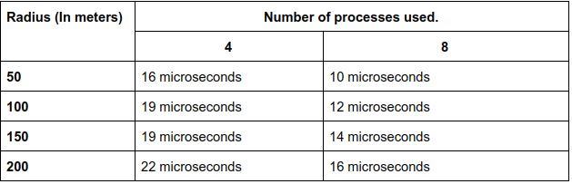

# Store Finder
This Repo Contains Code to find nearest entities near a given lat, long.
The Code is Designed to use in-memory instead of a traditional DB.

## How to use this for other projects?
1. Import **NearestLocator** class from **location_base.py**.
1. Write a subclass which inherits from NearestLocator Class and Override the **process_locations** Method.
1. The process_locations method should contain code to get your locations (may be through, s3, file etc) and this method should pass the lat, long to find_nearest_locations method which returns the entities matched within the given radius.

**Note**: Sample Location DB structure is available in **sample_location_db.csv**.

## How does the code work?
* Based on the radius we need, we calculate the min_latitude and max_latitude.
* Limit the locations to the latitudes that satisfy the above condition, to make the filtering faster we sort the locations by latitude.
* Calculate the distance between qualified locations and the given location, filter ones who do not satisfy the condition.

## How to scale the code?
* Vertical scaling can be done by spawning multiple processes and sharing the locations so there is no duplication of locations in memory this is done by using COW i.e data is only duplicated in child process if the data is modified, since our location data is read only we can use this. An example for this is already implemented in benchmark/benchmark.py.
* Horizontal scaling can be done by splitting the data based on Geography, Ex: A single machine can contain data of just a Continent, Country etc.

## Benchmarking the code
All the tools required for benchmarking are available in **benchmark** directory.

Running a benchmark can be done by running `python3  benchmark/benchmark.py`

Usage instructions on benchmark settings can be obtained by running `python3 benchmark/benchmark.py -h`.

Our test location database has around 1.5 million locations. For the purpose of this test, we performed the test on around 10,000 random locations and the results are as follows The time is for a single request.

